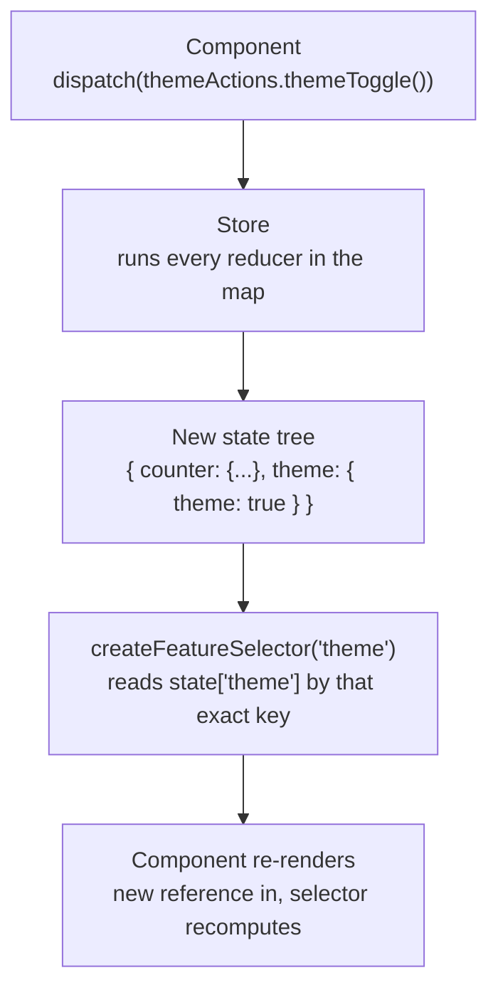

# Project 1 — Counter / Theme Toggle: Notes

## What was built

Two independent NgRx feature slices in a standalone Angular app:

- **counter** — `{ count: number, previousCount: number }`, with increment/decrement/reset actions
- **theme** — `{ theme: boolean }`, with a single `themeToggle` action

---

## 1. Why NgRx over a service + `BehaviorSubject`?

A service/Subject works fine for one small piece of state in one place. It breaks down at scale because:

1. **No traceability** — anyone can call `.next()` from anywhere; no record of _why_ state changed.
2. **No enforced immutability** — nothing stops direct mutation of the subject's value.
3. **State gets scattered** — a dozen ad-hoc services instead of one inspectable source of truth.
4. **Side effects tangle with state updates** — async logic and state mutation end up mixed in the same method.

NgRx fixes this by forcing every change through a named **action**, handled by a **pure reducer function**, with async/side-effecting logic pushed out into **Effects** (not yet covered).

This is a tradeoff, not a universal win — for genuinely local component state, a service with signals is often _simpler_ (Project 8 will cover this directly).

---

## 2. Actions

- Use `createActionGroup` to group related events under one `source` string — avoids repeating `createAction` boilerplate.
- Use `emptyProps()` for actions that don't need data (e.g., `increment`, `themeToggle`).
- **Action naming should describe the event, not the resulting state.**
  - ❌ `setTheme` (no props) that actually flips a boolean — the name lies about behavior.
  - ✅ `toggleTheme` — matches what the reducer does.
- **Where should "what's the next value" logic live — component or reducer?**
  - `setTheme(theme: boolean)` forces the **component** to read current state and compute the flipped value before dispatching — logic leaks out of the reducer.
  - `toggleTheme()` (no props) lets the **reducer** compute the next value — this is correct: components describe _events_, reducers decide _state transitions_.
  - `setTheme(value: boolean)` isn't wrong in general — it's right for cases like "restore a known saved preference on app init," where you already have the target value, not a toggle.
- **Watch for action proliferation** — before adding a new action, ask "is there an actual driving use case?" (e.g., three separate reset actions were justified here because a real UI offered three distinct controls — not because "more actions" felt thorough).

---

## 3. Reducers

- Always return a **new object reference** (`{ ...state, ... }`) — never mutate in place.
- **Why this matters beyond "immutability is good practice":** selector memoization (see below) relies on reference equality. A mutated-in-place state object has the _same_ reference even though its contents changed — so a memoized selector's cache thinks nothing changed and never recomputes, silently breaking the UI.
- **Every reducer in the map runs on every dispatched action** — reducers don't "listen" selectively. Each reducer's `on()` handlers decide whether a given action means anything to them. (Useful mental model for debugging: dispatching an action always reaches every reducer; whether it _does_ anything depends on whether that reducer has a matching `on()`.)
- Ordering gotcha when deriving one field from another (e.g., `previousCount` from `count`): using object-literal syntax like `{ ...state, previousCount: state.count, count: state.count + 1 }` is safe — both properties read from the _original_ `state` object before the new object is constructed, so there's no stale-vs-fresh ordering bug here.

---

## 4. Selectors

- `createFeatureSelector<T>('key')` + `createSelector(...)` is the standard pattern.
- **A selector's projector function has two jobs, not one:**
  1. Project/derive a piece of state (the obvious one).
  2. **Memoize** — cache the last input/output pair. If the same state _reference_ comes in again, the projector doesn't re-run; the cached result is returned.
- The memoization payoff isn't visible with cheap/identity selectors — it matters once selectors do real computation (filtering, deriving) or once a component subscribes to a selector across frequent state-tree updates: if a _different_ slice of state changed but this selector's specific input slice didn't, memoization prevents wasted recomputation and wasted re-renders (especially valuable with `OnPush` components).
- Compose selectors from other selectors rather than duplicating projection logic against the feature selector directly.

---

## 5. `selectSignal` vs. `select` + `async` pipe

| | `selectSignal` | `select` + `| async` |
|---|---|---|
| Returns | `Signal` | `Observable` |
| Best for | Simple template display, aligns with Angular's signal direction | Composing with RxJS (`combineLatest`, `debounceTime`, feeding into Effects) |
| Naming | No `$` suffix (it's not an Observable!) | `$` suffix convention applies |

**Rule of thumb:** signals for template display, observables when you need to compose with RxJS. Effects specifically require Observables (built on the `Actions` stream) — this becomes concrete in Project 4.

**Naming discipline:** the `$` suffix means "this is an Observable" by convention — don't use it on a `Signal`-returning field. Caught this mistake twice in this project; make it a reflex check.

---

## 6. Feature slice cohesion — what makes two pieces of state "one feature"?

Ask: **if you deleted one field, would the other still make sense on its own?**

- `previousCount` without `count` → meaningless. Same feature.
- `theme` and `counter` → no shared fields, no shared reducer logic, no reason a theme-reading component would ever care about count. **Separate features, separate keys.**

Don't bolt unrelated state onto an existing reducer just because it's small — it creates a file that no longer matches its name and confuses future readers.

---

## 7. The silent failure mode: feature key mismatch

If `provideStore({ theme: themeReducer })` registers a key, but `createFeatureSelector('themeFeature')` (typo/different string) doesn't match it:

- **Write path still works completely** — the reducer runs regardless of key naming, because dispatch runs the whole reducer map. State really does update in the store.
- **Read path breaks** — the selector reads a slice that doesn't exist → `undefined` → destructuring it throws (`Cannot destructure property 'x' of undefined`), typically surfacing as a console error disconnected from the real cause.
- **No compile-time error** — the two key strings are just independent literals to TypeScript; nothing ties them together.
- **Debugging move:** check Redux DevTools first. If it shows the state correctly changing after the action, the **write path is fine — the problem is in the read path** (selector key mismatch, broken memoization from in-place mutation, missing subscription, wrong selector imported, or a change-detection issue).
- **Mitigation used in bigger codebases:** a shared `FEATURE_KEY` constant referenced by both `provideStore` and `createFeatureSelector`, so a typo only needs fixing in one place. (`createFeature`, covered later, solves this properly by deriving everything from one feature definition.)

---

## 7b. Flow: how `createFeatureSelector('theme')` actually connects to dispatched state

**The key insight: there is no real "connection" enforced by the type system.**

- `provideStore({ theme: themeReducer })` decides what key the reducer's output lands under in the live state tree.
- `createFeatureSelector<themeState>('theme')` is a _completely separate_ piece of code that reads `state['theme']` by that literal string — it has no knowledge of how `provideStore` was configured. It just does a plain object-key lookup.
- TypeScript checks the _shape_ you claim (`themeState`), but never checks that the string `'theme'` used here actually matches the string used in `provideStore`. Two independent string literals, kept in sync only by convention/discipline.
- **Dispatch and selection are on separate paths.** Dispatching an action runs the _entire_ reducer map, regardless of what any selector is subscribed to. So even if `createFeatureSelector` points at the wrong key, the state still updates correctly under whatever key was actually registered — the write path and read path fail (or succeed) independently.
- **Real fix for larger codebases:** `createFeature` (Project 6) derives the reducer registration and the selector from one shared definition, so there's only one place the key is written down at all.

---

## 8. Interview question — "UI not updating, but DevTools shows correct state"

> _"You're debugging a reported issue: a component displaying data from the NgRx store isn't updating, even though the user's action should change that data. Redux DevTools shows the action being dispatched and the state tree updating correctly. What are the possible causes, and how would you narrow it down?"_

**Starting point:** DevTools confirming the action dispatched _and_ the state tree updated correctly means the **write path is fine** — reducer ran, state genuinely changed. The problem is isolated entirely to how that state reaches the UI (the read path). Narrowing it down means walking the read path piece by piece:

1. **Feature key mismatch** — `createFeatureSelector('wrongKey')` reads a state slice that doesn't exist, or isn't the one that actually changed. Returns `undefined`; downstream destructuring throws.
2. **Broken selector memoization due to in-place mutation** — if a reducer mutates state instead of returning a new reference (`state.count++` instead of `{...state, count: state.count + 1}`), the _value_ is different but the object _reference_ is unchanged. `createSelector` compares inputs by reference, so it assumes nothing changed, never recomputes, and the component never re-renders — even though DevTools shows the new value (DevTools reads the raw state tree, not through memoized selectors).
3. **Broken/missing subscription in the component** — e.g., using `select()` but forgetting the `async` pipe, or capturing an `Observable` reference without ever subscribing, or doing a one-time `.subscribe()` in `ngOnInit` and storing the result in a plain field instead of staying reactive.
4. **Change detection issue** — an `OnPush` component receiving an update from outside Angular's zone, or misusing `selectSignal` such that the signal read isn't tracked as a dependency where it's used.
5. **Wrong selector used** — a copy-paste error importing/using a different, similarly-named selector than the one actually meant.

**Debugging method:** always start by confirming which side is broken — write or read. DevTools showing correct state changes but a stale UI is the tell that it's specifically a _read-path_ problem (selector, subscription, or change detection), not a reducer bug. Only after isolating to the read path do you drill into which of causes 1–5 applies (check the feature key strings match, check whether the reducer mutates in place, check the template's subscription mechanism, check change detection strategy, check the actual selector imported).

---

## Mastery snapshot (end of Project 1)

| Concept                                          | Level                                                                             |
| ------------------------------------------------ | --------------------------------------------------------------------------------- |
| Store setup (`provideStore`, `ActionReducerMap`) | 4/5                                                                               |
| Actions (`createActionGroup`, naming, props)     | 4/5                                                                               |
| Reducers (immutability, purity)                  | 4/5                                                                               |
| Selectors + memoization (conceptual)             | 3/5 — understands _why_, hasn't yet seen a case where memoization visibly matters |
| Feature slice cohesion / state shape design      | 4/5                                                                               |
| `selectSignal` vs. `select`+async tradeoffs      | 3/5                                                                               |
| Debugging (write-path vs. read-path isolation)   | 4/5                                                                               |

_(Full cumulative mastery tracking lives in the Progress Summary, produced every 3 completed projects — this table is scoped to Project 1 only.)_
